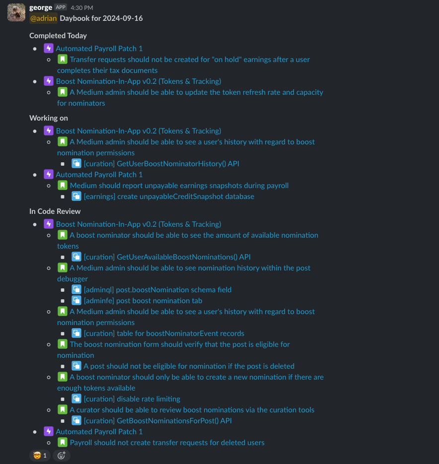

# JIRA Daybot

Yet another JIRA bot for Slack, to faciliate a form of daily check-in. This bot posts at the end of the day, with a report of what was Done, what is In Progress, and what's awaiting Review.

### Example Message

## Configuration

The bot is configured via environment variables. The following are required:

- JIRA
  - `JIRA_URL`: The URL of your JIRA instance.
  - `JIRA_USERNAME`: The username of the bot.
  - `JIRA_TOKEN`: API token for the bot to use
  - `JIRA_PROJECT`: The project key to report on.
- Slack
  - `SLACK_TOKEN`: The token for the bot to use to post messages.
  - `SLACK_DAYBOOK_CHANNEL`: The channel to post messages to.
- Schedule
  - `DAYBOOK_CRONTAB`: The schedule for the bot to run on. This is a cron expression.
  - `REMINDER_CRONTAB`: The schedule for the bot to send users a preview of what will be reported. This is a cron expression.

The environment variables can be set in a `.env` file in the root of the project, or simply set in the environment.

## Getting A User's Identifiers

The bot needs to know the JIRA AtlassianID (looks like "61843ea1892c420072fdd376") and the Slack UserID (looks like "U02L4NL51B6") for each user. See the documentation for each service on how to get these. This frequently changes, so I won't document it here.
